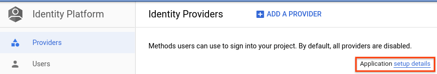
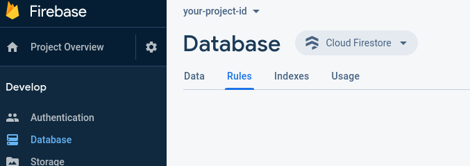

# Cloud Run for Anthos Reference Web App

This repository, including all associated workflows and automations, represents
an opinionated set of best practices aimed at demonstrating a reference architecture
for building a web application on Google Cloud using Cloud Run for Anthos.

A detailed description of the architecture of the web app can be found in [architecture.md][].

## Prerequisites

### Development Environment

*NOTE: the steps in this guide assume that you are working in a POSIX-based
development environment.*

The only requirement to run this example out of the box is a working
installation of `gcloud`. Optionally, having `make` installed will allow you
to make use of the convenience targets provided in the [`makefile`][].

*NOTE: Your `gcloud` user account must have [Owner permission][] in order
to complete setup of the application.*

#### Cloud Shell

This example can be run directly from Cloud Shell!

[](https://ssh.cloud.google.com/cloudshell/editor?cloudshell_git_repo=https%3A%2F%2Fgithub.com%2FGoogleCloudPlatform%2Fcloud-run-anthos-reference-web-app&cloudshell_git_branch=master)

#### Local Setup

Follow the steps to [set up gcloud][] in your local environment,
then `git clone` this repo.

### Custom Domain

For this reference application to work properly, you will need a custom domain
that has been set up properly and verified.

The easiest way to do this is by running the interactive script
[domain-setup.sh](domain-setup.sh):

```bash
./domain-setup.sh
```

#### Creating a Custom Domain

You can follow the steps at [cloud-tutorial.dev][] to get a
custom subdomain and managed zone that are ready to use.

#### Using an existing Custom Domain

Your custom domain will need to be associated with a [Cloud DNS Managed Zone][]
in the same project that you are using for this application. Be sure to
[update name server records][] to point to your managed zone.

#### Verifying Domain Ownership

You must complete [domain ownership verification][] for the reference
application to work.

You can create a TXT record using the following steps:

1. In [Cloud DNS][], navigate to the managed zone associated with your custom domain.
1. Click **Add record set**.
1. Set the **Resource Record Type** to **TXT**.
1. In the **TXT data** field, paste the TXT record provided from following the
   [domain ownership verification][] steps.
1. Click **Create**.

### Identity Platform for Auth and Firestore Setup

1. [Enable Identity Platform][] for your project.
   * This will create an OAuth 2.0 Client ID that can be used by the web application.
   * This additionally creates a Firebase project where Cloud Firestore can be used.
1. On the [Identity Platform -> Settings][] page, in the **Security** tab, add
   your custom domain under **Authorized Domains**.
1. Configure the [OAuth consent screen][].
   * You'll need to set the **Support email** and the
     **Application homepage link** (your Custom Domain).
   * Additional information
     [here](https://support.google.com/cloud/answer/6158849?hl=en#userconsent).
1. Configure your OAuth 2.0 Client ID to be used by your Custom Domain.
   * In the GCP console, navigate to [APIs & Services -> Credentials][].
   * Click on the OAuth 2.0 Client ID that was auto created.
     * **$PROJECT_ID.firebaseapp.com** _should_ appear under
       **Authorized JavaScript origins**.
   * Take note of the **Client ID** and **Client secret**. You'll use them in
     the next step.
   * Under **Authorized JavaScript origins**, add your custom domain.
   * Click **Save**.
1. Add **Google** as an Identity Provider in Identity Platform:
   * In the GCP console, navigate to [Identity Platform -> Providers][].
   * Click **Add a provider**.
   * Select **Google** from the list.
   * Fill in the **Web Client ID** and **Web Client Secret** fields with those
     from the OAuth 2.0 Client ID created in the previous step.
   * Click **Save**.
1. Setup `webui/firebaseConfig.js`:
   * Copy [webui/firebaseConfig.js.sample][] to `webui/firebaseConfig.js`:

     ```bash
     cp webui/firebaseConfig.js.sample webui/firebaseConfig.js
     ```

   * Fill in the **apiKey** and **authDomain** values in
     `webui/firebaseConfig.js` with the values found by navigating to
     [Identity Platform -> Providers][] and clicking on
     **Application setup details** on the right.
     
1. Set up the Firestore security rules:
   * Navigate to the Develop > Database > Rules in the Firebase console at:
     <https://console.firebase.google.com/project/$PROJECT_ID/database/firestore/rules>.
   * Ensure that **Cloud Firestore** is selected in the dropdown above.
     
   * Set the security rules to the ones found in
     [`firestore/firestore.rules`](firestore/firestore.rules)

## Deploying the Application for the First Time

This project uses [Cloud Build][] and [Config Connector][] to automate code and
infrastructure deployments.
The instructions below describe how to deploy the application.

### 1. Configure GCP Project

You will need to bootstrap the services and permissions required by this example.
The easiest way to do so is by running [bootstrap.sh](bootstrap.sh):

```bash
./bootstrap.sh $PROJECT_ID
```

This step additionally creates a file named `env.mk` based on [env.mk.sample](env.mk.sample).

### 2. Fill out TODO sections in `env.mk`

Address the TODO comment at the top of `env.mk` and ensure values are correct.

### 3. Create a GKE Cluster

Run `make cluster`

### 4. Add a verified owner for the domain

Add the following service account as an [additional verified owner][]:

`cnrm-system@${PROJECT_ID}.iam.gserviceaccount.com`

where `${PROJECT_ID}` is replaced by your Google Cloud project ID.

### 5. Build and deploy

Run `make build-all`

## Try Out the Application

Once your application is deployed, you can try it out by navigating to `https://$DOMAIN`,
where `$DOMAIN` is the custom domain
you configured in `env.mk`.

## Update the Application

Running `make build-all` will rebuild and deploy the app, including any changes
made to the infrastructure. Note that removing resources from `infrastructure-tpl.yaml`
will not cause them to be deleted. You must either run `make delete` before removing
the resource (then redeploy with `make build-all` after removing it), or manually
delete the resource with `kubectl delete`.

```shell
# builds and deploys backend, frontend, and KCC infrastructure
make build-all

# builds and deploys only the backend Go service
make build-backend

# builds and deploys only the frontend angular webapp
make build-webui
```

## Cleanup

Running `make delete` will delete the Config Connector resources from your cluster,
which will cause Config Connector to delete the associated GCP resources.
However, you must manually delete your Cloud Run service and GKE Cluster.

[APIs & Services -> Credentials]: https://console.cloud.google.com/apis/credentials
[Cloud Build]: https://cloud.google.com/cloud-build/docs
[Config Connector]: https://cloud.google.com/config-connector/docs
[Cloud DNS Managed Zone]: https://cloud.google.com/dns/zones
[Cloud DNS]: https://console.cloud.google.com/net-services/dns/zones
[update name server records]: https://cloud.google.com/dns/docs/migrating#update_your_registrars_name_server_records
[domain ownership verification]: https://cloud.google.com/storage/docs/domain-name-verification#verification
[additional verified owner]: https://cloud.google.com/storage/docs/domain-name-verification?_ga=2.256052552.-234301672.1582050261#additional_verified_owners
[Enable Identity Platform]: https://console.cloud.google.com/marketplace/details/google-cloud-platform/customer-identity
[Identity Platform -> Providers]: https://console.cloud.google.com/customer-identity/providers
[Identity Platform quickstart guide]: https://cloud.google.com/identity-platform/docs/quickstart-email-password#sign_the_user_in
[Identity Platform page in the GCP console]: https://console.cloud.google.com/marketplace/details/google-cloud-platform/customer-identity
[OAuth consent screen]: https://console.cloud.google.com/apis/credentials/consent
[Identity Platform -> Settings]: https://console.cloud.google.com/customer-identity/settings
[Setting up OAuth 2.0 guide]: https://support.google.com/cloud/answer/6158849?hl=en
[set up gcloud]: https://cloud.google.com/sdk/docs
[`makefile`]: makefile
[Owner permission]: https://console.cloud.google.com/iam-admin/roles/details/roles%3Cowner
[architecture.md]: ./docs/architecture.md
[cloud-tutorial.dev]: https://cloud-tutorial.dev/
