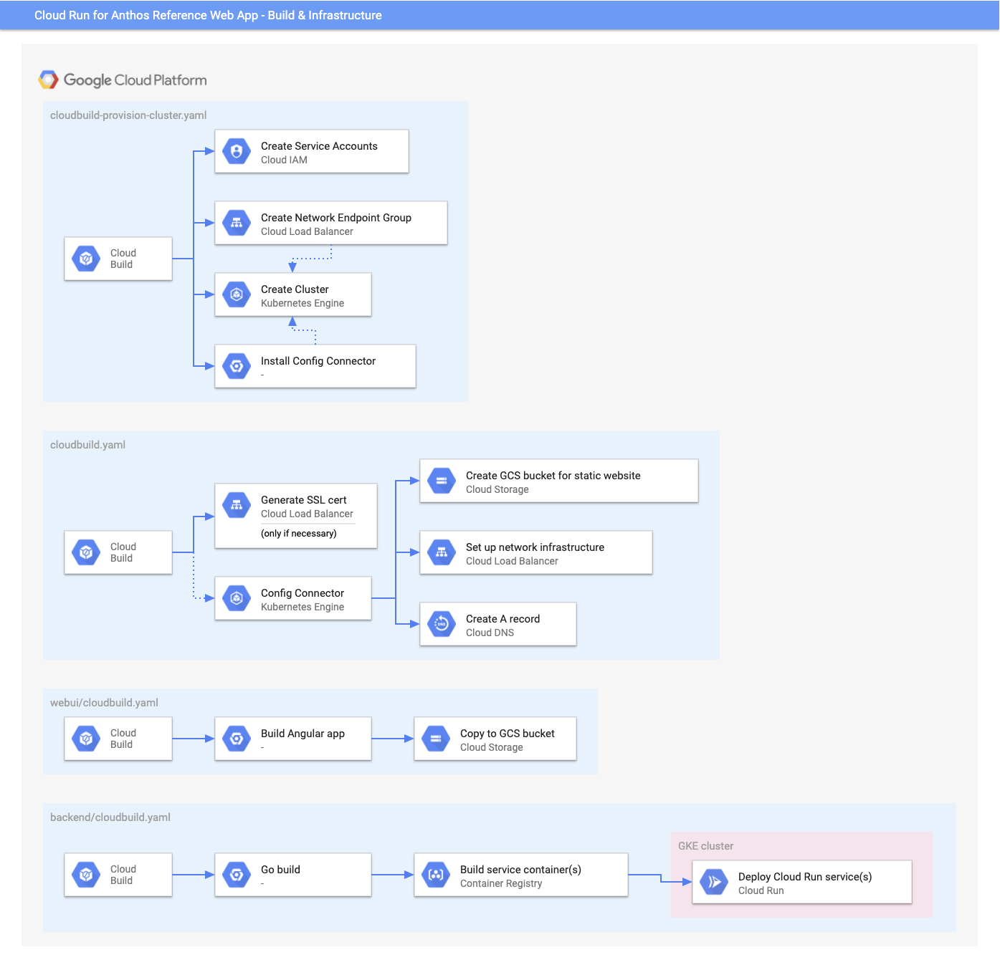

# Architecture

## Runtime

This reference web app uses a static [Angular][] frontend
[hosted in Google Cloud Storage][]. The frontend makes authenticated API calls
to [Cloud Run][] services running in a GKE cluster. [Cloud Firestore][] is used
for persistence.

### Networking

For every incoming request, traffic is directed to either the static GCS bucket
or the GKE cluster ingress using a [URL map][].

[By default][], all requests are directed to the GCS bucket unless the request path
begins with `/api`, in which case they are directed to the GKE cluster.

An [HTTPS target proxy][] secures incoming traffic using SSL. An SSL certificate
associated with the desired domain is either provided or [generated automatically][].

A [forwarding rule][] provides the publicly-accessible IP address for incoming requests.
The IP address of the forwarding rule is added to a [managed DNS zone][] for the
desired domain.

### Authentication & Authorization

Authentication is provided by [Identity Platform][], which issues
a [JSON Web Token (JWT)][] on the frontend that gets passed through
on subsequent requests and gets [validated by the Istio ingress][].

[Istio Authorization Policies][] enable access control to ensure certain operations are only accessible by certain users. Namely, there are policies to ensure:
 - Access is denied to users without a token
 - `GET` requests to the `/api` endpoint are authorized across all roles
 - `POST` requests to the `/api/inventoryTransactions` endpoint are authorized for workers
 - All operations to the `/api` endpoint are authorized for admins

## Build & Infrastructure

Build and setup is performed using [Cloud Build][].

Infrastructure is mostly orchestrated by [Cloud Config Connector][];
the declarative infrastructure configuration can be found in
[infrastructure-tpl.yaml][], [backend-service-template.jq][], and [dns-tpl.yaml][].

### API Generation

Both the frontend Typescript client and backend Golang server are
generated off of the [OpenAPI spec][]. This way, changes to the API
surface are automatically picked up by both the client and server
on the next build.

[high level architecture]: ./high-level-diagram.svg
[Angular]: https://angular.io/
[hosted in Google Cloud Storage]: https://cloud.google.com/storage/docs/hosting-static-website
[Cloud Run]: https://cloud.google.com/run/docs/gke/setup
[Cloud Firestore]: https://cloud.google.com/firestore
[networking diagram]: ./networking-diagram.svg
[Cloud Config Connector]: https://cloud.google.com/config-connector/docs/overview
[infrastructure-tpl.yaml]: ../infrastructure-tpl.yaml
[backend-service-template.jq]: ../backend-service-template.jq
[dns-tpl.yaml]: ../dns-tpl.yaml
[Cloud Build]: https://cloud.google.com/cloud-build
[URL map]: https://cloud.google.com/load-balancing/docs/url-map
[HTTPS target proxy]: https://cloud.google.com/load-balancing/docs/target-proxies
[forwarding rule]: https://cloud.google.com/load-balancing/docs/forwarding-rule-concepts
[managed DNS zone]: https://cloud.google.com/dns/docs/overview#dns-managed-zones
[generated automatically]: https://cloud.google.com/load-balancing/docs/ssl-certificates/google-managed-certs
[authentication diagram]: ./authentication-diagram.svg
[Identity Platform]: https://cloud.google.com/identity-platform
[JSON Web Token (JWT)]: https://tools.ietf.org/html/rfc7519
[validated by the Istio ingress]: https://cloud.google.com/solutions/authenticating-cloud-run-on-gke-end-users-using-istio-and-identity-platform
[build diagram]: ./build-diagram.svg
[OpenAPI spec]: ../openapi.yaml
[By default]: ../infrastructure-tpl.yaml#L93
[Istio Authorization Policies]: https://archive.istio.io/v1.5/docs/reference/config/security/authorization-policy/