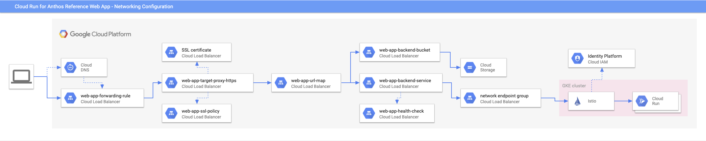
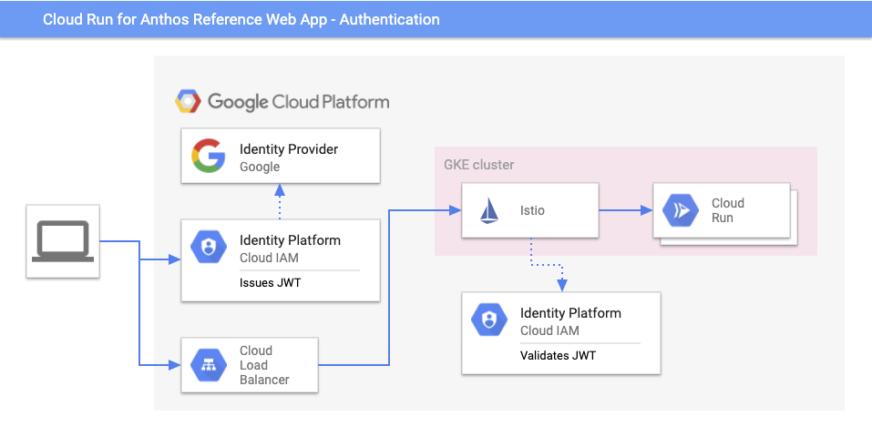

  Español |
  <a href="https://github.com/GoogleCloudPlatform/cloud-run-anthos-reference-web-app/blob/master/docs/architecture.md">English</a> |

# Arquitectura

## Runtime

Esta aplicación web de referencia utiliza un frontend estático en [Angular][]
[alojado en Google Cloud Storage][]. El frontend realiza llamadas API autenticadas a los servicios de [Cloud Run][] ejecutados en un clúster de GKE. [Cloud Firestore][] es usado para la persistencia de los datos de dicha aplicación.

### Redes

Para cada solicitud entrante, el tráfico se dirige al depósito GCS estático o al ingreso del clúster GKE mediante un [mapa de URL][].

[Por defecto][], todas las solicitudes se dirigen al depósito GCS a menos que comience la ruta de solicitud `/api`, en cuyo caso se dirigen al clúster de GKE.

Un [proxy de destino HTTPS][] asegura el tráfico entrante mediante SSL. Un certificado SSL asociado con el dominio deseado se proporciona o se [genera automáticamente][].

Una [regla de reenvío][] proporciona la dirección IP de acceso público para las solicitudes entrantes. La dirección IP de la regla de reenvío se agrega a una [zona DNS administrada][] para el dominio asignado.

### Autenticación

La autenticación es provista por [Identity Platform][], que emite un [JSON Web Token (JWT)][] en el frontend que se transfiere en solicitudes posteriores y se [valida por Istio ingress][].

## Compilación e Infrastructura

La compilación y configuración es realizad por [Cloud Build][].

La infraestructura está principalmente orquestada por [Cloud Config Connector][];
la configuración de infraestructura declarativa se puede encontrar en
[infrastructure-tpl.yaml][], [backend-service-template.jq][], y [dns-tpl.yaml][].

### Generación de API

Tanto el cliente front-end Typecript como el servidor back-end Golang se generan a partir de la [OpenAPI spec][]. De esta manera, los cambios en la superficie de la API son recogidos automáticamente por el cliente y el servidor en la próxima compilación.

[high level architecture]: ./high-level-diagram.svg
[Angular]: https://angular.io/
[alojado en Google Cloud Storage]: https://cloud.google.com/storage/docs/hosting-static-website
[Cloud Run]: https://cloud.google.com/run/docs/gke/setup
[Cloud Firestore]: https://cloud.google.com/firestore
[networking diagram]: ./networking-diagram.svg
[Cloud Config Connector]: https://cloud.google.com/config-connector/docs/overview
[infrastructure-tpl.yaml]: ../infrastructure-tpl.yaml
[backend-service-template.jq]: ../backend-service-template.jq
[dns-tpl.yaml]: ../dns-tpl.yaml
[Cloud Build]: https://cloud.google.com/cloud-build
[mapa de URL]: https://cloud.google.com/load-balancing/docs/url-map
[proxy de destino HTTPS]: https://cloud.google.com/load-balancing/docs/target-proxies
[regla de reenvío]: https://cloud.google.com/load-balancing/docs/forwarding-rule-concepts
[zona DNS administrada]: https://cloud.google.com/dns/docs/overview#dns-managed-zones
[genera automáticamente]: https://cloud.google.com/load-balancing/docs/ssl-certificates/google-managed-certs
[authentication diagram]: ./authentication-diagram.svg
[Identity Platform]: https://cloud.google.com/identity-platform
[JSON Web Token (JWT)]: https://tools.ietf.org/html/rfc7519
[valida por Istio ingress]: https://cloud.google.com/solutions/authenticating-cloud-run-on-gke-end-users-using-istio-and-identity-platform
[build diagram]: ./build-diagram.svg
[OpenAPI spec]: ../openapi.yaml
[Por defecto]: ../infrastructure-tpl.yaml#L93
